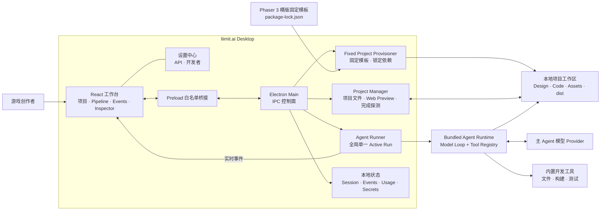
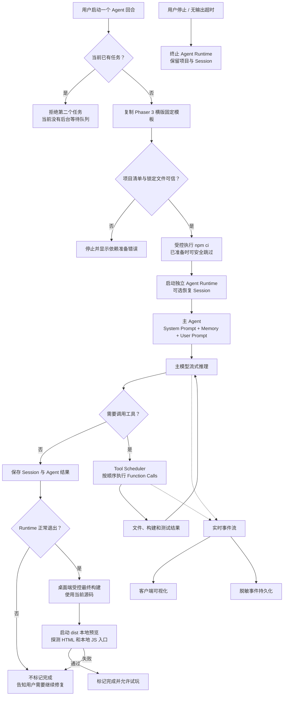

<div align="center">
  
  <h1>liimit.ai</h1>
  <p><strong>把一个游戏想法，变成可运行、可继续迭代的本地项目。</strong></p>
  <p>
    本地优先的 AI 横版游戏制作客户端。当前只走一条固定主线：基于 Phaser 3 模板制作
    2D 横版平台跳跃游戏，构建通过后直接在 liimit.ai 内试玩。
  </p>
  <p>
    <a href="#下载客户端">下载客户端</a>
    ·
    <a href="#快速开始">快速开始</a>
    ·
    <a href="docs/gameagent/NO_API_BEGINNER_GUIDE.md">不接 API 小白手册</a>
    ·
    <a href="#产品架构">产品架构</a>
    ·
    <a href="docs/gameagent/DESKTOP_GUIDE.md">使用文档</a>
  </p>
  <p>
    
    
    
    
    
  </p>
</div>

<div align="center">
  
</div>

## 下载客户端

> **当前状态：** 源代码公开在
> [GitHub：wubaijian/liimit.ai](https://github.com/wubaijian/liimit.ai)。正式安装包尚未发布，
> 请先从源码运行，或在本机构建 macOS / Windows 候选安装包。

> Windows 候选安装包尚未进行 Authenticode 代码签名，系统可能显示“未知发布者”或
> SmartScreen 提示。它适合测试，不是正式发行版；请勿关闭 Windows 安全保护。

## 产品业务：liimit.ai 解决什么问题

做一个横版平台跳跃原型，往往需要自己创建工程、安装依赖、写代码、查构建错误，再启动浏览器试玩。普通 AI 对话能给出代码片段，但不会自然地把这些步骤连成一个可恢复、可验证的本地项目。

liimit.ai 把这些环节组织成一条可观察、可停止、可恢复的本地制作流程：

| 问题                               | liimit.ai 的处理方式                                   |
| ---------------------------------- | ------------------------------------------------------ |
| 每次都要重搭工程                   | 始终从同一套 Phaser 3 横版游戏模板开始                 |
| 依赖版本不一致，今天能跑明天不能跑 | 在 Agent 启动前按 `package-lock.json` 自动准备固定依赖 |
| Agent 工作像黑盒，出错后难定位     | 展示制作阶段、工具调用、文件变化与错误                 |
| AI 说“做完了”，但游戏打不开        | 只有 Web 构建成功且本地试玩入口探测通过才标记完成      |
| 中断一次就要从头开始               | 保留项目文件与 Session，可停止、恢复并继续修改         |

liimit.ai 当前面向想快速验证 **2D 横版平台跳跃** 玩法的创作者。它的目标是缩短“想法 → 首个浏览器可玩版本 → 持续迭代”的路径，而不是生成任意类型或商业成品游戏。

## 从想法到可玩版本

<div align="center">
  
</div>

1. **描述横版玩法**：选择本地目录，说明主角、关卡、障碍、终点和美术方向。
2. **准备固定工程**：liimit.ai 复制 Phaser 3 横版模板，验证锁定文件并自动准备依赖。
3. **在模板上制作**：Agent 围绕已有的玩家移动、跳跃、平台与关卡结构继续修改。
4. **构建并探测**：Agent 正常退出后，桌面端重新构建当前源码，再探测 HTML 和本地 JavaScript 入口。
5. **试玩迭代**：只有第 4 步通过才显示完成；用户可在应用内试玩，再继续提出修改要求。

## 核心能力

| 业务模块              | 当前能力                                                                 |
| --------------------- | ------------------------------------------------------------------------ |
| **固定横版模板**      | 只创建 Phaser 3、2D 横版平台跳跃、Web 输出的项目                         |
| **自动依赖准备**      | 用受控命令按提交的 `package-lock.json` 准备依赖，不让 Agent 临时换版本   |
| **AI 游戏制作工作台** | 项目、制作阶段、事件流、文件浏览和 Web 预览集中在一个桌面客户端          |
| **可观察 Agent**      | 支持停止、会话恢复、无输出监控，并展示制作事件与错误                     |
| **可玩完成门槛**      | 不采信 Agent 的文字声明；当前源码必须重新构建，HTML 和本地 JS 入口都可读 |
| **本地与安全**        | 工程保存在用户选择的目录；API Key 使用当前操作系统的安全存储             |

## 固定产品模式

| 项目     | 当前固定选择                                      |
| -------- | ------------------------------------------------- |
| 游戏引擎 | Phaser 3                                          |
| 游戏类型 | 2D 横版平台跳跃                                   |
| 运行平台 | Web 浏览器                                        |
| 初始工程 | 内置固定模板                                      |
| 依赖版本 | `package.json` + `package-lock.json` 锁定         |
| 完成标准 | 当前源码受控构建成功，且本地 HTML/JS 入口探测通过 |

Unity、Godot、Unreal、Blender、Skills、MCP 以及其他游戏类型**不属于当前固定生产流程**。仓库中可能仍有历史兼容代码或开发者研究入口，它们不是当前向用户交付的制作能力，也不在这条主线的验收范围内。

## 产品架构



Renderer 无法直接读取密钥或启动子进程。模板复制、锁定依赖准备、Agent 运行和本地预览都由主进程中的受控服务执行。

## 产品 Agent 结构



当前桌面调度器一次只运行一个 Agent 任务。“Agent 已回答”和“项目已完成”是两件事；后者还必须用当前源码重新构建，再通过独立的 Web 入口探测。

## 能力边界

> liimit.ai 是自动化开发工具，不是“一键生成商业成品”的无代码平台。

- 当前只能在固定模板上制作 **Phaser 3 的 2D 横版平台跳跃 Web 游戏**。
- 不提供任意游戏类型选择、3D 制作、外部引擎制作或通用插件扩展承诺。
- 可玩门槛会验证 `dist/index.html`、`#game-container` 和同源本地 JavaScript 入口可读，但不代替真人通关、手感和内容质量验收。
- 正常 Agent 制作依赖用户配置的模型 API、网络和额度，费用由模型服务商收取。仓库的基础设施黄金路径检查不调用付费模型。
- Agent 可以在项目目录写文件并运行命令。建议使用 Git 或其他方式备份，并在发布前完成代码、许可证与素材来源审查。
- 当前没有云同步、多人协作或内置自动更新；公开构建仍需对应平台的代码签名，macOS 还需要 Apple 公证。

## 快速开始

### 安装版与候选目标

- 当前 M1 源码目标：macOS Apple Silicon 与 Windows 11 x64。
- 上方 Windows v0.2.2 仅是已通过当时原生 CI 的历史未签名候选版，不代表当前
  M1 已通过 Windows 实机验收。新闭环必须在新的 Windows 原生 CI 与安装包测试通过后再发布。
- 当前不包括 Windows on ARM、32 位 Windows、便携版和 Microsoft Store 版。

普通用户不需要为每个项目手工执行 `npm install`。liimit.ai 会在 Agent 启动前检查固定模板的项目清单和锁定文件，然后使用宿主机上探测到的 Node.js/npm，通过固定参数、不经过系统 Shell 的受控命令自动准备依赖。准备失败时会停止本轮任务并显示错误，不会让 Agent 临时改依赖版本。

> **当前打包版风险：** 项目依赖准备和最终受控构建尚未内置独立的 Node.js/npm，仍需要宿主机已安装可用的
> Node.js 20+ 和 npm。干净机器缺少它们时，客户端可以打开，但启动 Agent 会在依赖准备阶段失败，已准备项目也无法通过最终构建。
> 当前打包和 Runtime smoke 不能代替“未安装 Node.js/npm 的干净系统”实机验收。

### 从源码开发的环境要求

- Node.js 20 或更高版本
- npm 与 Git

### 从源码启动

```bash
# 在当前 liimit.ai 仓库根目录执行
cd liimit.ai
npm install
npm run bundle
npm run desktop
```

首次使用：

1. 打开“设置 → API 管理”，配置主 Agent 的 Provider、Model、Base URL 与 API Key。
2. 新建项目，选择一个专用本地目录，并输入 2D 横版平台跳跃游戏的创意。
3. 启动 Agent。liimit.ai 会先复制固定模板并准备锁定依赖，再开始制作。
4. 在工作台观察阶段、文件和错误。只有桌面端受控最终构建与本地 HTML/JS 入口探测都通过时，项目才会显示完成。
5. 打开右侧“预览”试玩，再继续提出关卡、移动、跳跃或美术修改要求。

### 构建当前系统安装包

```bash
npm run desktop:package
```

该命令会根据当前宿主系统构建 Agent Runtime、桌面界面和原生依赖，完成 Runtime 冒烟测试，
然后在 macOS 生成 DMG、在 Windows 生成 NSIS Setup EXE。原生依赖必须在目标系统构建；不要
把 Mac 上交叉组装的 Windows 包作为正式产物。

macOS 当前版本产物：

```text
packages/desktop/release/liimit.ai-0.2.2-arm64.dmg
```

本地构建没有 Apple Developer ID 时不会获得 Apple 公证。首次打开可在 Finder 中按住 Control 点击应用并选择“打开”，或前往“系统设置 → 隐私与安全性”确认打开。

正式签名与公证构建需要配置 Apple 签名凭据，然后运行：

```bash
npm run desktop:package:signed
```

### 构建 Windows 11 x64 安装包

在 Windows 11 x64 PowerShell 中运行：

```powershell
npm ci
npm run desktop:package:win
```

开发安装包位于：

```text
packages/desktop/release/liimit.ai-0.2.2-windows-x64-setup.exe
```

普通构建没有 Authenticode 签名，只适合内部测试，Windows 可能显示“未知发布者”或 SmartScreen
提示。不要关闭系统保护；CI 会把开发安装包与 SHA-256 作为 `unsigned-dev` Actions Artifact
上传。只有签名验证与 Windows 实机验收通过后，维护者才应把安装包、SHA-256 和签名状态发布到自己的发行页面。正式构建需要配置 Windows 代码
签名凭据，并把仓库变量 `LIIMIT_WINDOWS_SIGNER` 配置为证书 Subject 中的发布者名称，然后执行：

```powershell
npm run desktop:package:win:signed
```

验证安装包、Runtime、x64 架构、启动和签名模式：

```powershell
npm run desktop:verify:win
Get-FileHash packages/desktop/release/liimit.ai-0.2.2-windows-x64-setup.exe -Algorithm SHA256
Get-AuthenticodeSignature packages/desktop/release/liimit.ai-0.2.2-windows-x64-setup.exe
```

当前版本没有内置自动更新。安装新版时重新下载并运行 Setup EXE 完成覆盖安装；安装器配置为
保留应用数据，卸载也不以用户主动选择的游戏项目目录为目标。正式发行前仍须用 N→N+1 实机
测试确认配置、凭据和项目均保持可用。

仅生成未封装的本机调试 App：

```bash
npm run desktop:package:app
```

## 开发与验证

```bash
# 桌面端类型检查与生产构建
npm run desktop:build

# 桌面端测试
npm test --workspace=@gameagent/desktop

# Agent live harness 默认只做离线类型检查，不调用模型
npm test --workspace=agent-test

# 仅在明确批准真人监看和 Provider 费用时单独运行
npm run test:live --workspace=agent-test

# 全仓类型检查
npm run typecheck

# 固定模板 → 真实 npm ci → Web 构建 → HTTP 入口探测
npm run smoke:playable --workspace=@gameagent/desktop
```

`smoke:playable` 是不调用模型 API 的基础设施黄金路径检查，因此不产生 AI Provider
费用。它会在临时目录中复制固定模板，真实执行 `npm ci` 和 Web 构建，确认
`dist/index.html` 与浏览器 JavaScript 已生成，再用 Desktop 的本地 HTTP 规则探测 HTML 和本地 JS
入口。它**不会启动真实浏览器操作角色**；左右移动、跳跃、危险物恢复和到达终点必须在
应用内预览中单独做人工 QA。首次运行可能访问 npm 软件包源；这是依赖下载，不是模型调用。

更多资料：

- [桌面使用说明](docs/gameagent/DESKTOP_GUIDE.md)
- [API 配置](docs/gameagent/API_CONFIGURATION.md)
- [详细技术架构](docs/gameagent/ARCHITECTURE.md)
- [Spec Kit 研发流程](docs/SPECKIT.md)

### Agent 无输出保护

桌面版监控 Agent Runtime 的模型与工具输出：连续 90 秒无输出时显示等待提示，连续 4 分钟无输出时停止本轮并保留项目文件与 Session ID，可从原会话继续。可通过环境变量调整：

```bash
GAMEAGENT_AGENT_IDLE_TIMEOUT_MS=360000 npm run desktop
```

## 许可证与品牌

项目代码按 [Apache-2.0 License](LICENSE) 开放。liimit.ai 的当前代码与品牌资产由本项目维护者继续管理。

Phaser 与其他第三方依赖的品牌和代码归各自权利人所有；文档中的名称不代表相关品牌对 liimit.ai 的认可或背书。

## 参与贡献

欢迎通过未来配置的项目仓库提交 Issue 或 Pull Request。影响固定模板、锁定依赖或可玩完成门槛的变更，请附上聚焦测试和黄金路径冒烟检查结果。
