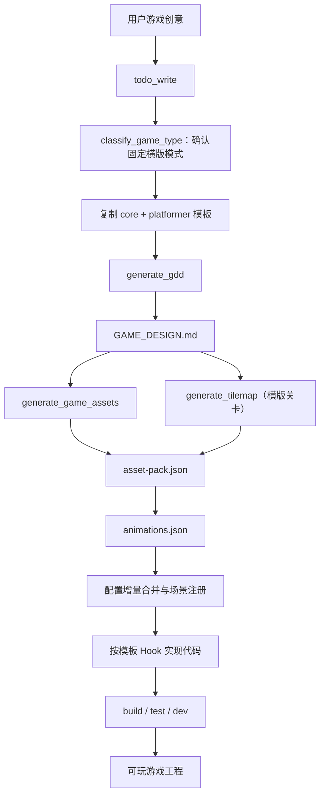

# GameAgent 架构说明

## 1. 复刻边界

GameAgent 直接保留 OpenGame 的源码级 Agent Runtime，而不是重新模拟一个聊天机器人。以下能力与上游保持一致：

- OpenAI-compatible 模型适配，包括 DeepSeek。
- 单主 Agent 的模型—工具—工具结果循环。
- `ToolRegistry`、JSON Schema 参数校验、Function Call 与权限模式。
- 文件、Shell、搜索、Memory、Task 子 Agent 与 MCP 工具。
- 用户级/项目级 Skills，以及 STDIO、Streamable HTTP、SSE MCP Server。
- `classify_game_type`、`generate_gdd`、`generate_game_assets`、`generate_tilemap`。
- 固定 Phaser/Vite 横版平台模板、platformer 契约文档和 Debug Protocol。
- JSONL 会话记录、上下文压缩与 `--resume` 恢复。

桌面端是新增产品层，不替换 Agent 内核。

## 2. 真实 Agent 模型

OpenGame 的在线生成不是多个常驻 Agent，而是：

1. 一个主代码 Agent。
2. GDD 工具中的一次独立 LLM 调用；游戏类型不再调用模型分类。
3. 固定 platformer 脚手架、素材与 Tilemap 工具。
4. 可选、无状态、阻塞式 `task` 子 Agent。

```mermaid
flowchart LR
  UI["Electron Renderer"] --> IPC["Preload / IPC"]
  IPC --> Main["Electron Main"]
  Main --> CLI["OpenGame CLI 子进程"]
  CLI --> Client["GeminiClient"]
  Client --> Adapter["OpenAI Compatible Adapter"]
  Adapter --> LLM["DeepSeek / 其他模型"]
  LLM --> Turn["Turn 解析流与 Function Call"]
  Turn --> Scheduler["CoreToolScheduler"]
  Scheduler --> Registry["ToolRegistry"]
  Registry --> Tools["文件 / Shell / 游戏工具 / Task"]
  Tools --> Client
  CLI -->|"NDJSON 精简事件"| Main
  Main --> IPC
```



## 3. 桌面进程隔离

每次用户提交提示词，Electron main 启动一个独立 CLI 子进程：

```text
node dist/cli.js
  --auth-type openai
  --output-format stream-json
  --include-partial-messages
  --approval-mode yolo
  --chat-recording
  --model <model>
  [--resume <sessionId>]
```

提示词通过 stdin 发送，不放入进程参数。main 解析 stdout 的 NDJSON，renderer 只接收经过截断和脱敏的 UI 事件。这样可以：

- 避免 API Key 与提示词出现在进程列表。
- 停止任务时可靠终止整个 Agent 回合。
- 每次恢复创建新进程，释放上一回合内存。
- 阻止巨型 `write_file.content` 或 base64 数据通过 IPC structured clone。

## 4. 游戏制作流程



桌面 UI 根据真实 tool name 推导当前阶段；协议名称保持英文，面向用户的说明使用中文。

## 5. Memory 与恢复

- 长期记忆：全局或项目级 `QWEN.md`，不是向量数据库。
- 会话记忆：`~/.qwen/projects/<project>/chats/<sessionId>.jsonl`。
- 上下文压缩：旧对话经 LLM 摘要为 `<state_snapshot>`，保留最近对话。
- 桌面恢复：持久化权威 `session_id`，下一回合使用相同 cwd 和 `--resume <sessionId>`。
- 工作区文件与 `GAME_DESIGN.md` 是崩溃后最可靠的外部状态。

## 6. 密钥模型

`safeStorage` 使用 macOS Keychain / Windows 系统加密能力保存密钥。renderer 只能获得 `apiKeyConfigured`，不能读取明文。

启动 Agent 时，main 进程只在内存中解密当前配置，并通过一个匿名文件描述符（fd 3）把一次性凭据快照交给 CLI。凭据不会出现在命令行参数或子进程环境变量中；CLI 读取完后立刻关闭通道并只保留内存配置：

- `OPENAI_*`：主 Agent。
- `OPENGAME_REASONING_*`：GDD 生成。
- `OPENGAME_IMAGE_*`：图像与动画。
- `OPENGAME_VIDEO_*`：视频/I2V。
- `OPENGAME_AUDIO_*`：音频结构生成。
- MCP Server 的 Env/Header：由桌面安全存储加密后随同一匿名 fd 快照传入。

CLI 启动环境和 Agent 创建的 Shell/PTY 环境还会二次删除名称包含 `KEY`、`TOKEN`、`SECRET`、`PASSWORD`、`AUTH`、`CREDENTIAL` 的变量。日志与 IPC 事件会做长度限制和密钥脱敏。因此密钥不会进入 renderer、项目文件、进程列表、Shell 命令环境或会话日志。

## 7. Skills 与 MCP

- Skills 管理数据仍可读取，但固定横版项目的 Agent Runtime 不加载用户级或项目级 Skills。
- 桌面端导入 Skill 时校验 `SKILL.md`，拒绝符号链接，并使用原子目录移动避免暴露半成品。
- MCP 配置保存在桌面状态中，敏感 Env/Header 由 `safeStorage` 加密；只把脱敏状态返回 renderer。
- 固定横版项目启动时使用空 MCP allowlist；已保存的 MCP 配置不会注入该项目 Runtime。
- 底层配置服务仍能保存本地 STDIO、Streamable HTTP 与 SSE 定义，但它们不属于当前固定横版制作主线。

## 8. 关键源码

- 桌面入口：`packages/desktop/src/main/main.ts`
- Agent 子进程桥：`packages/desktop/src/main/agentRunner.ts`
- 安全设置存储：`packages/desktop/src/main/store.ts`
- 项目/预览服务：`packages/desktop/src/main/projectManager.ts`
- Skills 管理：`packages/desktop/src/main/extensionManager.ts`
- MCP 配置：`packages/desktop/src/main/mcpConfig.ts`
- 桌面界面：`packages/desktop/src/renderer/App.tsx`
- 中文主提示词：`agent-test/prompts/custom.md`
- 主 Agent：`packages/core/src/core/client.ts`
- Function Call：`packages/core/src/core/turn.ts`
- 工具调度：`packages/core/src/core/coreToolScheduler.ts`
- 会话：`packages/core/src/services/sessionService.ts`
- 游戏工具：`packages/core/src/tools/`
