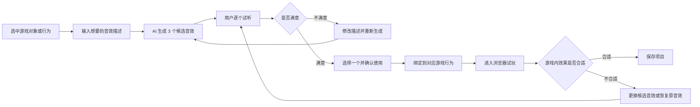

# Limit AI V3.1——AI 音效生成增补需求

## 1. 文档信息

| 项目         | 内容                                          |
| ------------ | --------------------------------------------- |
| 产品名称     | Limit AI                                      |
| 文档类型     | 第三版 PRD 的独立增补需求                     |
| 增补版本     | V3.1                                          |
| 计划归档日期 | 2026 年 4 月 8 日                             |
| 计划开发时间 | 2026 年 4 月中旬至 4 月底                     |
| 计划测试时间 | 2026 年 5 月                                  |
| 使用范围     | 公司内部                                      |
| 目标用户     | 游戏策划、关卡设计人员、程序开发人员          |
| 项目团队     | 1 名产品经理、3～4 名研发人员，由产品总监负责 |

> 本文档只补充“AI 生成游戏音效”能力，不替换第三版 PRD，也不改变第三版原本的核心目标。第三版原定功能继续按原计划开发和验收。

---

## 2. 为什么增加这项需求

Limit AI 已经可以帮助内部人员搭建游戏、编辑关卡并进行试玩，但制作一款游戏时，音效仍然需要人工完成以下工作：

1. 到素材网站寻找合适的声音。
2. 下载并试听多个素材。
3. 对声音进行裁剪、重命名和整理。
4. 将声音与跳跃、拾取金币、受到伤害等游戏行为连接起来。
5. 反复试玩，判断声音是否合适。

这些步骤单独看并不复杂，但会反复出现在每个游戏中，属于耗时较多的重复劳动。因此，在第三版开发中途增加一个独立的 AI 音效模块，让用户用一句话生成几个可选音效，再由用户试听和确认。

这项功能的核心不是“让 AI 自动决定游戏应该用什么声音”，而是“让 AI 快速准备候选声音，最后仍由制作人员决定是否使用”。

---

## 3. 本次目标

### 3.1 要解决的问题

- 减少用户寻找、下载和整理基础游戏音效的时间。
- 让没有专业音频制作经验的用户也能快速得到可用的候选音效。
- 让生成、试听、绑定和游戏试玩在同一个平台内完成。
- 保留人工确认环节，避免不合适的声音被直接放进游戏。

### 3.2 第一阶段只做到什么程度

用户选中一个游戏对象或游戏行为，输入自己想要的声音，AI 一次生成 3 个候选音效。用户逐个试听，选择其中一个，确认后将它绑定到游戏中，再通过浏览器试玩检查最终效果。

### 3.3 本次明确不做

- 不生成完整背景音乐。
- 不生成人物对白、旁白或角色配音。
- 不做真人声音克隆。
- 不根据游戏画面自动替换全部音效。
- 不让 AI 在用户未确认时直接修改项目。
- 不在玩家正式游玩时临时调用 AI 生成声音。
- 不做根据战斗强度实时变化的自适应音乐。

这些能力可以在 V3.1 验证有效后，再决定是否进入后续版本。

---

## 4. 典型使用场景

### 场景一：给金币增加拾取音效

用户选中“金币”，输入“短促、明亮、有一点像玻璃碰撞的奖励声音”。系统生成 3 个候选声音，用户试听后选择第 2 个，确认绑定，再进入试玩检查拾取金币时的效果。

### 场景二：替换角色受伤音效

用户选中“玩家受到伤害”，输入“像素游戏风格，沉闷但不要吓人，时长半秒左右”。系统生成候选声音。用户认为都不合适，可以修改描述后重新生成，不影响原有音效。

### 场景三：为开门行为补充音效

用户选中“门”，输入“老旧石门缓慢打开的摩擦声”。用户确认其中一个候选声音后，平台将它与开门行为连接。试玩不满意时，用户可以换另一个候选声音，或恢复原来的固定音效。

---

## 5. 用户操作流程

用户看到的实际步骤如下：

1. 在关卡编辑页面选中角色、金币、敌人、门或其他支持的对象。
2. 打开右侧的“音效”区域，选择要添加声音的行为。
3. 点击“AI 生成音效”。
4. 用一句话描述希望得到的声音。
5. 点击“开始生成”，等待系统返回 3 个候选音效。
6. 点击播放按钮逐个试听。
7. 选择一个候选音效，点击“确认使用”。
8. 进入浏览器试玩，触发对应行为并听取实际效果。
9. 用户可以保留、更换、重新生成或恢复原音效。
10. 保存项目后，确认使用的音效随项目一起保存在本机；导出游戏时一起打包。

---

## 6. 功能需求

### 6.1 支持的游戏行为

V3.1 第一阶段至少支持以下 8 类常用行为：

| 对象或行为 | 音效触发时机           | 示例描述                     |
| ---------- | ---------------------- | ---------------------------- |
| 角色跳跃   | 角色离开地面时         | 轻快的像素弹跳声             |
| 二段跳     | 角色在空中第二次跳跃时 | 比第一次更有力量的短促跳跃声 |
| 拾取金币   | 金币被玩家获得时       | 清脆明亮的奖励声             |
| 角色受伤   | 玩家碰到伤害来源时     | 短促、沉闷、不吓人的受伤声   |
| 角色死亡   | 生命耗尽时             | 复古游戏失败提示声           |
| 敌人被消灭 | 敌人死亡或消失时       | 软体怪物被踩扁的声音         |
| 开门或机关 | 门开启或机关被触发时   | 沉重石门缓慢打开的摩擦声     |
| 关卡完成   | 玩家到达终点时         | 简短、有成就感的通关提示声   |

后续可以增加攻击、Boss、按钮、宝箱等行为，但不能影响以上基础行为的完成时间。

### 6.2 音效描述

- 用户可以自由输入中文或英文描述。
- 输入框旁提供简单示例，帮助用户说明“是什么声音、什么风格、什么感觉、希望多长”。
- 用户可以选择建议时长，第一阶段范围为 0.5～8 秒。
- 用户不填写时长时，由系统根据行为类型给出默认时长。
- 输入为空时不能开始生成，并用普通语言提示用户先描述声音。

### 6.3 候选音效生成

- 每次生成返回 3 个候选音效。
- 三个候选结果使用相同要求，但应当存在可听出的差别。
- 生成期间显示当前状态，不能只显示一个一直转动但没有解释的等待画面。
- 等待时间超过 20 秒时，提示用户系统仍在处理，并允许取消。
- 单个候选生成失败时，展示已经成功的结果，并允许补充生成失败的候选。
- 三个候选全部失败时，保留用户输入，并提供“重新生成”。

### 6.4 试听与选择

- 每个候选结果都有独立的播放、暂停和重新播放按钮。
- 页面显示候选编号、音效时长和生成状态。
- 同一时间只播放一个候选，播放新的候选时停止上一个。
- 试听不会修改游戏，只有用户点击“确认使用”后才会绑定。
- 用户确认前，原有音效始终保留。

### 6.5 绑定到游戏

- 用户确认后，系统将音效连接到当前选择的对象和行为。
- 页面明确显示“这个音效将在什么情况下播放”。
- 同一种行为只能有一个当前启用的音效，用户更换时覆盖当前启用项，但保留原音效的恢复入口。
- 用户保存项目后，绑定关系和音效文件都保存在本机。
- 用户导出游戏时，已经确认的音效随游戏文件一起导出。

### 6.6 试玩与恢复

- 用户可以直接进入 Web 浏览器试玩，不需要先导出游戏。
- 试玩时触发对应行为，必须播放用户刚刚确认的音效。
- 用户返回编辑器后，可以继续使用、换一个候选、重新生成或恢复原音效。
- 恢复原音效不删除 AI 生成文件，避免用户误操作后无法找回；用户可以在素材管理中主动删除不用的文件。

### 6.7 生成记录

每次生成至少保存以下信息：

- 用户输入的描述。
- 生成日期和时间。
- 使用的服务与模型版本。
- 生成耗时。
- 候选音效数量。
- 用户最终选择的候选编号。
- 是否在试玩后继续使用。
- 本次调用的大致费用。

这些信息用于后续模型比较、成本统计和问题排查，不需要全部展示在主操作页面。

---

## 7. 页面与状态要求

AI 音效区域至少需要清楚展示以下状态：

| 状态       | 用户应该看到什么                           |
| ---------- | ------------------------------------------ |
| 尚未开始   | 描述输入框、示例和“开始生成”按钮           |
| 正在生成   | 当前进度说明、已等待时间和“取消”按钮       |
| 部分成功   | 已生成的候选、失败数量和“补充生成”按钮     |
| 全部成功   | 3 个可以试听和选择的候选音效               |
| 生成失败   | 失败原因的简单说明、原输入和“重新生成”按钮 |
| 已选未确认 | 被选中的候选和“确认使用”按钮               |
| 已确认     | 当前绑定对象、触发行为和“去试玩”按钮       |
| 试玩后     | “继续使用”“更换音效”“恢复原音效”三个入口   |

任何失败都不能损坏关卡，也不能让用户已经保存的原音效丢失。

---

## 8. AI 与用户的责任边界

### AI 负责

- 根据用户描述生成 3 个候选音效。
- 给生成文件自动命名并保存到当前项目。
- 记录生成信息，帮助后续评测和统计。

### 系统负责

- 将音效和用户选择的游戏行为连接起来。
- 提供试听、确认、试玩、替换和恢复能力。
- 在 API 失败时保护项目和原有素材。

### 用户负责

- 描述希望得到的声音。
- 试听候选结果。
- 决定是否使用、使用哪一个。
- 通过试玩判断声音在游戏里是否合适。

> 最终原则：AI 只提供候选方案，用户确认后才修改游戏。

---

## 9. 验收标准

以下条件全部满足，V3.1 才能进入内部测试：

1. 至少支持第 6.1 节中的 8 类游戏行为。
2. 用户可以用中文描述音效，并正常发起生成。
3. 一次请求可以返回 3 个能够播放的候选音效；如果未全部成功，系统能明确显示失败情况。
4. 用户可以独立试听每个候选音效。
5. 用户没有点击“确认使用”前，游戏项目不得发生音效替换。
6. 确认绑定后，在浏览器试玩中触发对应行为时能够听到所选音效。
7. 用户可以恢复原音效，恢复后再次试玩结果正确。
8. 保存并重新打开项目后，已确认的音效和绑定关系仍然存在。
9. 导出游戏后，音效文件和游戏一起打包，不依赖运行时再次调用 AI。
10. API 超时、失败或用户取消时，关卡和原有素材不受影响。
11. 系统能够记录生成次数、耗时、费用和最终采用结果。

---

## 10. 效果评估指标

V3.1 进入内部测试后，由约 4 名内部用户使用真实游戏任务进行验证。

| 指标             | 说明                                  | 判断方式               |
| ---------------- | ------------------------------------- | ---------------------- |
| 生成成功率       | 一次请求至少得到 1 个可播放候选的比例 | 越高越稳定             |
| 首轮采用率       | 用户第一次生成后直接选用候选的比例    | 判断描述与结果是否匹配 |
| 平均生成轮数     | 一个最终采用的音效平均生成几轮        | 轮数越少，效率越高     |
| 完成时间         | 从开始找声音到绑定完成所需时间        | 与原人工流程比较       |
| 试玩后保留率     | 试玩后没有被撤销的音效比例            | 判断实际游戏效果       |
| 单个采用音效成本 | 得到一个最终采用音效所花的 API 费用   | 判断是否划算           |
| 问题修复时间     | 处理不合适音效所花的时间              | 避免 AI 反而增加工作量 |

判断原则：

- 与原来的人工找素材流程相比，平均节省时间达到 30% 以上，继续优化并扩大使用范围。
- 节省时间低于 30%，重新判断交互流程、模型选择或功能方案。
- 如果处理 AI 结果所花的时间超过节省的时间，暂停这项生成能力。
- 是否更换音效模型，不只看效果，还要同时比较速度、稳定性和费用。

---

## 11. 开发安排

| 时间           | 主要工作                       | 完成标志                               |
| -------------- | ------------------------------ | -------------------------------------- |
| 4 月 8 日前后  | 增补需求评审                   | 产品总监和研发确认范围，不影响 V3 主线 |
| 4 月 9～12 日  | 音效 API 和技术验证            | 能生成、播放并保存一个测试音效         |
| 4 月 13～20 日 | 完成描述、生成、等待状态和试听 | 用户能得到并试听 3 个候选音效          |
| 4 月 21～25 日 | 完成确认绑定、恢复和浏览器试玩 | 游戏内能够正确播放并恢复音效           |
| 4 月 26～30 日 | 修复问题并完成内部验收         | 通过第 9 节的全部验收标准              |
| 5 月           | 约 4 名内部用户真实测试        | 收集时间、轮数、费用和采用情况         |

如果 AI 音效模块影响第三版核心功能交付，则先关闭该入口，第三版按原范围发布；V3.1 顺延到 5 月单独测试。

---

## 12. 主要风险与处理方法

| 风险                | 可能发生的问题                          | 处理方法                                         |
| ------------------- | --------------------------------------- | ------------------------------------------------ |
| 结果不稳定          | 描述相同但结果差异较大                  | 一次提供 3 个候选，允许重新生成，保留原音效      |
| 生成时间较长        | 用户误以为平台卡住                      | 展示状态和等待时间，支持取消，超时后给出明确提示 |
| API 不可用          | 外部服务失败导致无法生成                | 不阻塞编辑和试玩，继续使用固定素材，允许稍后重试 |
| 成本过高            | 多次生成造成费用不可控                  | 记录每次费用，设置单次和每日使用上限             |
| 音量不一致          | 不同音效在游戏里忽大忽小                | 导入时做基础音量检查，并允许用户调节音量         |
| 使用权不清楚        | 生成内容的使用范围存在疑问              | 选型时确认服务条款，记录服务、模型和生成时间     |
| 中途增加需求拖慢 V3 | 新功能挤占 Godot 和新游戏类型的开发时间 | V3.1 独立排期、独立验收，必要时延期而不阻塞 V3   |
| 功能范围不断扩大    | 从音效扩展到音乐、配音，无法按期完成    | 第一阶段严格只做短音效，其他能力进入后续需求池   |

---

## 13. 与第三版 PRD 的关系

- 第三版 PRD 继续负责新增游戏类型、Godot 相关编辑流程和原定功能。
- V3.1 只增加一个可以独立开关的 AI 音效模块。
- 第三版不依赖 V3.1；即使 AI 音效不可用，用户仍可使用固定音效完成游戏。
- V3.1 不修改第三版原有验收标准，只增加本文档中的单独验收标准。
- 研发排期冲突时，优先保证第三版主流程可以完整使用。

---

## 14. 后续可能的迭代方向

只有 V3.1 的内部测试证明能够节省时间后，才评估以下能力：

- AI 生成背景环境声。
- AI 生成短背景音乐。
- 让 AI 根据游戏风格推荐音效描述。
- 多个关卡共用一套音效主题。
- 音效素材库的分类、搜索和复用。
- 不同音效生成模型的自动对比。

以上内容不是 V3.1 的交付承诺。

---

## 15. 一句话说明

Limit AI V3.1 让游戏制作人员选中一个游戏行为、说出想要的声音，AI 生成 3 个候选音效，用户试听并确认后再放进游戏中，从而减少寻找和整理基础音效的重复工作。
